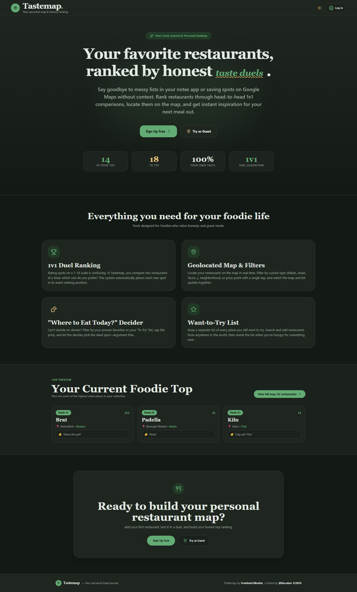
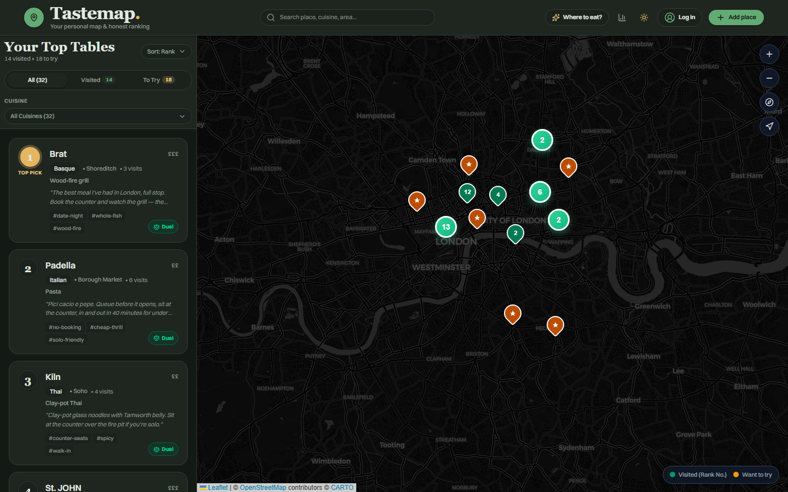

# Tastemap — Rocabor

A personal, honestly-ranked map of everywhere I've eaten — every place as a pin, ranked head-to-head instead of by star ratings.

**Challenge:** [Tastemap on Frontend Mentor](https://www.frontendmentor.io/challenges/restaurant-ranking-app)

**Live URL:** https://tastemap-khaki.vercel.app





---

## Overview

Tastemap replaces useless star ratings with a **relative** ranking: a place earns its position by being compared head-to-head against places you've already been. I took the **full-stack path** — Supabase for authentication and Postgres storage, a keyless Leaflet map, and a binary-insertion ranking flow that places a new "been" restaurant in ~log₂(n) questions.

Visitors hit a landing page with a one-click **Try as Guest** that loads a lived-in London map (32 real places, 25 comparisons) so the value is obvious in seconds. Signing up saves your own data to Supabase, guarded by row-level security.

### Tech Stack

| Layer | Technology |
|-------|-----------|
| Framework | Nuxt 4 (Vue 3, Vite) |
| Map | Leaflet + Leaflet.markercluster, CARTO basemaps (keyless OSM tiles) |
| Database | Supabase Postgres (dedicated `tastemap` schema, RLS) |
| Authentication | Supabase Auth (email/password + Google OAuth) |
| Hosting | Vercel |
| Styling | Tailwind CSS v4 + Grove design tokens |
| Other | Pinia, Zod + vee-validate, @nuxtjs/supabase, @vueuse, canvas-confetti |

---

## Design Decisions

### The Ranking Experience

**The problem I was solving:** Turning "which was better, A or B?" into a trustworthy ordered list without asking the user forty questions once their list grows.

**My approach:** **Binary insertion.** When a place is marked *been*, it's inserted into the sorted ranked list by bisection: compare against the midpoint, halve the candidate range, repeat. A 30-place list needs about 5 comparisons. The duel shows a live progress readout ("~3 questions left") and lets the user stop with **"Too close to call"** — in which case the new place slots just below its opponent and no more comparisons are wasted. Ranks are resolved positions (#1, #2, …) recomputed after every insertion and removal. I store **both** the raw head-to-head results (a `comparisons` table) and the resolved `rank` column, so the order can be re-derived or re-placed later. Re-ranking any place reopens the same bisection flow against the current list, and removing a place from the ranking keeps the record as *want to try*.

**Why I chose this approach:** It's the only strategy that keeps question count logarithmic as the list grows, and the "too close to call" escape hatch directly addresses comparison fatigue — the user never grinds through a full tree for a marginal placement.

**What I'd do differently:** I'd add an Elo-style confidence score under the hood to detect unstable placements (and surface "this rank might be wrong"), and a bulk/fast mode that re-places several places at once. I'd also make the tie behaviour configurable (slot above vs below).

### The "Where Should We Eat?" Moment

**The problem I was solving:** Turning a map full of pins into an actual decision when someone is hungry and undecided.

**My approach:** A **"Surprise me" decider** modal. You pick a mood (*been* / *want to try* / *anyone*) and an optional max price, and it randomly recommends one matching place — showing its card with a "take me there" action that pans the map to the pin and opens the detail sheet. Deliberately left out: distance/geolocation (adds permission friction on the guest path) and any preference weighting — the whole point of the product is that the ranking *is* the taste model.

**Why I chose this approach:** Zero friction, playful, and it leans on the core premise: if you trust the ranking, a random pick from the right filtered slice is a good pick. It works identically for guests and signed-in users.

**What I'd do differently:** A "near me" mode using geolocation for the *"I've just landed — what did I want to eat here?"* moment, and a "best of two" quick vote when you genuinely can't decide.

### Map and List, Living Together

**The problem I was solving:** Two views of one dataset — spatial and ordered — that must feel like one product on both desktop and mobile.

**My approach:** A single Pinia store is the source of truth; the map and the ranked rail render from it, so filters, search, and selection can never fall out of sync. On desktop they sit side-by-side; on mobile a **segmented control** switches between map and list (they can't both fill a phone screen). Selecting a pin opens its popup and highlights the list row; hovering a list row pans/zooms the map to the pin; selecting a row opens a right-side **detail sheet** (a bottom-anchored sheet on small screens). The map cluster-places dense areas, recentres with `fitBounds` on load and on filter changes, and is **lazy-loaded** (client-only dynamic import) so it doesn't tax first paint. The map itself is keyboard-reachable — markers are focusable and open their popup with Enter.

**Why I chose this approach:** One store keeps sync trivial and the segmented control is the clearest mobile resolution of "two full-screen things can't coexist" — no hidden gesture to discover.

**What I'd do differently:** On mobile I'd try a floating bottom sheet that slides over the map instead of a hard toggle, and on desktop a drawer that collapses when the rail loses focus.

### Other Design Choices

- **Pin system:** Grove palette — solid pins for *been*, distinct style for *want to try*, with cluster counters; icons invert cleanly in dark mode.
- **Cuisine avatars:** cuisine-tinted initials as the always-valid baseline for list rows and detail views.
- **Dark mode:** full palette switch **including the map** (CARTO dark tiles), respecting `prefers-color-scheme` with a persisted manual toggle and no flash on load.
- **Landing page:** one-line wedge statement ("star ratings are useless"), product showcase, and a prominent "Try as Guest" CTA.
- **Detail sheet** slides in from the right (mobile: bottom) with all quick actions: edit, delete, toggle status, re-rank, view on map.
- **Accessibility:** 100 on Lighthouse for both pages — keyboard-reachable map, focus-trapped modals, `prefers-reduced-motion` respected, semantic landmarks.

---

## Development Journey

### Initial Approach vs. Final

I started with the frontend-only core (map + rail + duel on the London sample data) to nail the two hard problems — the ranking flow and the map/list relationship — before touching auth. That foundation carried into the full-stack build almost unchanged: the store's data source is swappable, so the same UI reads from the sample JSON (guest) or Supabase (signed-in). The final product keeps the guest experience as a first-class surface because that's what a recruiter clicks first.

### Decisions Reconsidered

- **Mobile map/list:** I first tried an overlay arrangement, then settled on the segmented control after real touch testing — it's the least surprising pattern.
- **Share modal:** an early social-share feature was cut because it wasn't in spec; energy went into the decider and dark mode instead.
- **Detail sheet direction:** changed to slide-from-right/bottom for better spatial anchoring of "this belongs to that pin".

### What Surprised Me

- **Map tiles are the LCP.** The third-party CARTO tiles (~1MB on a London viewport) dominate the performance budget no matter how lean the app code is — good lesson about third-party content.
- **RLS + schema exposure:** PostgREST needs `pgrst.db_schemas` to expose the custom schema, and the anon role needs grants *plus* RLS to be actually safe — easy to get subtly wrong.
- **The `hookable` pnpm trap on Vercel:** a local `vercel build` with pnpm silently produced serverless functions missing a transitive dependency; switching to Vercel's remote build fixed it instantly.

### Session Breakdown

| Session | Focus | What I Accomplished |
|---------|-------|-------------------|
| 1 | Foundation | Interactive map + marker clusters, ranked rail, the comparison duel, detail sheet, tablet/mobile layout |
| 2 | Full-stack flows | Place CRUD with Zod + vee-validate, search/filter, decider, Supabase auth + persistence + RLS |
| 3 | Polish & ship | World geocoding via Nominatim proxy, click-to-pin, dark mode, taste stats, 100 a11y, perf passes (lazy map/modals/JSON), Vercel deploy |

---

## AI Collaboration Reflection

### How I Used AI

AI was most valuable for the mechanical build-out: component scaffolding, the binary-insertion state machine, the Supabase/RLS wiring, and the fine-grained CSS. I kept the product decisions — how ranks are displayed, how the mobile map/list resolves, what the decider asks for — for myself, and treated the specs (`spec/`, `guidance/`) as the contract the AI had to honour.

### What Worked Well

Short, single-responsibility prompts scoped to one file or one flow, plus insisting the AI run the actual audit/typecheck commands before claiming done. When the AI proposed features outside the spec (the share modal), pushing back kept scope honest.

### What I Learned

That the AI's confidence is not information. It will happily describe a feature it hasn't written or claim a build is green without running it — so the workflow settled into "AI proposes, I review, tooling decides": typecheck, build, and Lighthouse were the only verdicts that counted. I also learned that giving the AI the specs (`core-requirements.md`, `brand-kit.md`) as the contract beat describing features in prose — it stayed in-scope and matched the Grove system without constant correction.

### Where I Pushed Back

- **Cut a "share my map" feature** the AI kept pushing early on — it wasn't in the spec and it was scope creep; the effort went into the decider and dark mode instead.
- **Kept the mobile map/list as a segmented control** when the AI suggested a slide-over drawer — after touch-testing, the toggle was the least surprising pattern.
- **Refused login-gating the guest experience.** The AI proposed a sign-up wall at one point; the whole point of this project is that a stranger clicks the link and sees the product in one click.
- **Rejected "just optimize images" as a perf answer** and insisted on measuring with Lighthouse — the real win was lazy-loading the map and code-splitting, not compressing assets that barely existed.

---

## Differentiators

### Chosen Differentiator: Add Places by Search (Keyless Geocoding)

**Why I chose this:** A real third-party API integration is the "handles real-world API friction" signal — and staying keyless means no secrets to manage or leak.

**How it enhances the product:** Adding a place goes from "type an address and drop a pin by hand" to "type the restaurant name and pick the right match", with the location snapped to returned coordinates.

**Implementation highlights:**
- A **Nuxt server proxy** (`/api/nominatim/search` + `/reverse`) keeps the OSM request server-side, sends a descriptive `User-Agent` (+ configurable contact email) as their usage policy requires, and avoids leaking the client origin.
- Debounced search with loading/error states and ambiguous-match results (name + address context).
- Full **manual fallback**: click-to-pin placement and address typing work if search fails or the place isn't found.

**What I learned:** How much "keyless" still requires good citizenship (rate-limiting, UA, proxy) — and that a graceful fallback chain is the difference between a feature and a liability.

---

## Self-Assessment

<!-- TODO personal — adjust ratings and notes honestly -->

| Category | Rating | Notes |
|----------|--------|-------|
| **Works for real users** — Deployed, functional end-to-end | 5/5 | Live on Vercel, guest + Google auth + CRUD verified |
| **Ranking quality** — Comparisons feel fair and fast; the order is trustworthy; re-ranking works | 4/5 | log₂(n) insertion + "too close to call"; re-ranking and bulk re-place could be smoother |
| **The map** — Renders quickly, clusters sensibly, distinguishes been/want, keyboard-reachable | 4/5 | Clusters + dark tiles + keyboard; tiles dominate LCP on /mapa |
| **Map + list coherence** — The two views feel like one product and stay in sync | 4/5 | Single-store sync; mobile toggle is clear if not exotic |
| **Design quality** — Typography, spacing, visual hierarchy, polish | 4/5 | Grove tokens, Bespoke Serif + Switzer, cuisine avatars |
| **Responsive design** — Fully functional and well-designed across devices | 4/5 | Segmented control + bottom sheets; more real-device QA wanted |
| **Performance** — Fast load, smooth interactions, efficient marker rendering | 4/5 | Landing 100; /mapa 74 (tile-bound) |
| **Accessibility** — Keyboard nav, screen reader support, contrast | 5/5 | 100 on both pages incl. keyboard-reachable map |
| **Edge case handling** — Empty states, ties, single ranked place, missing data | 4/5 | Tie path, empty states, guest fallbacks covered |
| **Landing page & guest experience** | 5/5 | One-click guest into a full London map + ranking |

### Lighthouse Scores

Ran against the **deployed** site (Slow 4G):

| Category | / (Landing) | /mapa |
|----------|-------------|-------|
| Performance | 100 | 74 |
| Accessibility | 100 | 100 |
| Best Practices | 100 | 100 |
| SEO | 100 | 100 |

### Strengths

The thing I'm most proud of is that the ranking actually *feels* trustworthy and fast: binary insertion means adding a 30th place costs ~5 duel questions, and "too close to call" means you're never forced into a false preference. I also like how the map and the rail read as one product — hover a row, the map flies to the pin; tap a pin, the row lights up. The guest experience is the closest thing to "instant wow" I've shipped: one click into a dense London map with a ready-made top ten.

### Areas for Improvement

With more time I'd: give re-ranking a gentler UX (currently it re-opens the full duel), pull /mapa's LCP down with tile-caching on an edge CDN, add real device testing on Android/iOS (the segmented control deserves it), and support photo uploads instead of URL-only. I'd also re-examine the decider — a proper wheel animation would make the pick feel more playful than the current card.

---

## Known Limitations

- **/mapa LCP is tile-bound** — third-party CARTO tiles (~1MB) set the ceiling; a CDN + tile caching helps, but the map *is* the content.
- **Guest data is session-only** — a refresh resets it (by design; data lives in memory, sample JSON on the client).
- **Photos are optional URL fields** — no managed upload storage yet.
- **No lists/collections** (stretch #10) or multi-city grouping — the ranking is one flat, global list.
- **Nominatim is rate-limited by policy** — debounced, but heavy searching could hit limits.

---

## Running Locally

```bash
# Clone the repo
git clone https://github.com/Rocabor/restaurant-ranking-app.git
cd restaurant-ranking-app

# Install dependencies (pnpm)
pnpm install

# Set up environment variables
cp .env.example .env
# Fill in your Supabase project URL and publishable key

# Run the development server
pnpm dev
```

### Environment Variables

| Variable | Description |
|----------|------------|
| `SUPABASE_URL` | Your Supabase project URL (e.g. `https://xxxx.supabase.co`) |
| `SUPABASE_KEY` | Your publishable (anon) Supabase API key — safe for the browser |

> The Google OAuth flow needs the deployed URL added under **Supabase → Authentication → URL Configuration** (Site URL + Redirect URLs). Run `supabase/schema.sql` in the SQL editor once to create the schema and RLS policies.

---

## Acknowledgments

Built as a [Frontend Mentor Product Challenge](https://www.frontendmentor.io). Sample London data provided in the challenge starter; map tiles © OpenStreetMap contributors and © CARTO; geocoding by OpenStreetMap's Nominatim.
